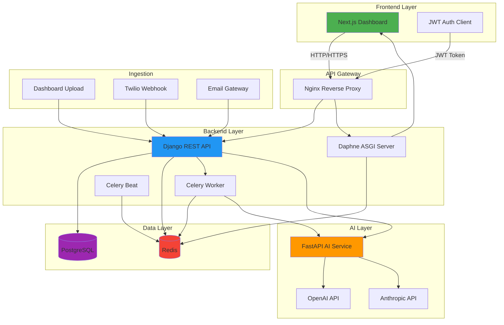

# WeWill - Multi-tenant Document Reconciliation System

Sistema multi-tenant per la riconciliazione automatica di documenti (PDF, CSV/Excel) con AI e revisione umana.

## Architettura

### Diagramma Mermaid



### Architettura Dettagliata

```
┌─────────────────┐    ┌─────────────────┐    ┌─────────────────┐
│   Next.js 14    │    │   Django 5      │    │   FastAPI       │
│   (Frontend)    │◄──►│   (Backend)     │◄──►│   (AI Service)  │
│   Port: 3000    │    │   Port: 8000    │    │   Port: 8001    │
│                 │    │                 │    │                 │
│ - Dashboard     │    │ - REST API      │    │ - OCR + LLM     │
│ - JWT Auth      │    │ - Admin         │    │ - Extraction    │
│ - Real-time UI  │    │ - Multi-tenant  │    │ - Classification │
└─────────────────┘    └─────────────────┘    └─────────────────┘
                              │
                              ▼
                       ┌─────────────────┐
                       │   PostgreSQL 16 │
                       │   Port: 5432    │
                       │                 │
                       │ - Tenant Data   │
                       │ - Documents     │
                       │ - Reconciliations│
                       └─────────────────┘
                              │
                              ▼
                       ┌─────────────────┐
                       │   Redis 7       │
                       │   Port: 6379    │
                       │                 │
                       │ - Celery Broker │
                       │ - Cache         │
                       │ - SSE Events    │
                       └─────────────────┘

Servizi aggiuntivi:
- Daphne (ASGI Server): Port 8002 - Real-time updates via WebSocket/SSE
- Celery Worker: Task queue processing for async document processing
- Celery Beat: Scheduled tasks and periodic jobs
- Twilio Webhook: Port 8000/api/webhooks/twilio/ - WhatsApp document ingestion
```

## Stack Tecnologico

| Layer | Tecnologia |
|-------|-----------|
| Frontend | Next.js 14 + TypeScript + TailwindCSS |
| Backend | Django 5 + DRF + Celery |
| AI Service | FastAPI + OpenAI/Anthropic |
| Database | PostgreSQL 16 |
| Cache/Queue | Redis 7 |
| Real-time | Daphne ASGI + Channels |
| Auth | JWT (djangorestframework-simplejwt) |
| Containerization | Docker + Docker Compose |

## Prerequisiti

- Docker 24.0+
- Docker Compose 2.0+
- Make (opzionale, puoi usare docker-compose direttamente)

## Setup Rapido

### Sviluppo (Locale)

1. **Clona il repository**
   ```bash
   git clone <repository-url>
   cd wewill
   ```

2. **Copia il file environment**
   ```bash
   cp .env.example .env
   ```

3. **Configura le variabili d'ambiente**
   Edit `.env` e inserisci le tue API keys e password:
   - `POSTGRES_PASSWORD`
   - `DJANGO_SECRET_KEY`
   - `OPENAI_API_KEY` (o altri provider AI)
   - Altre variabili necessarie

4. **Avvia i servizi**
   ```bash
   make up
   # oppure
   docker-compose up -d
   ```

5. **Esegui le migrazioni**
   ```bash
   make migrate
   # oppure
   docker-compose exec django python manage.py migrate
   ```

6. **Crea il superuser**
   ```bash
   make createsuperuser
   # oppure
   docker-compose exec django python manage.py createsuperuser
   ```

### Produzione (VPS)

1. **Clona il repository sulla VPS**
   ```bash
   git clone <repository-url> /opt/wewill
   cd /opt/wewill
   ```

2. **Copia il file environment**
   ```bash
   cp .env.example .env
   nano .env  # Configura per produzione
   ```

3. **Login a Docker Hub**
   ```bash
   docker login
   ```

4. **Avvia i servizi con docker-compose.prod.yml**
   ```bash
   docker-compose -f docker-compose.prod.yml pull
   docker-compose -f docker-compose.prod.yml up -d
   ```

5. **Esegui le migrazioni**
   ```bash
   docker-compose -f docker-compose.prod.yml exec django python manage.py migrate
   docker-compose -f docker-compose.prod.yml exec django python manage.py createsuperuser
   ```

**Nota**: Watchtower aggiornerà automaticamente i container ogni 5 minuti quando nuove immagini sono pushate su Docker Hub.

## Comandi Makefile

| Comando | Descrizione |
|---------|-------------|
| `make up` | Avvia tutti i container |
| `make down` | Ferma tutti i container |
| `make logs` | Mostra i logs di tutti i container |
| `make logs-django` | Mostra i logs di Django e Daphne |
| `make logs-celery` | Mostra i logs di Celery worker e beat |
| `make logs-fastapi` | Mostra i logs di FastAPI |
| `make logs-nextjs` | Mostra i logs di Next.js |
| `make migrate` | Esegue le migrazioni Django |
| `make makemigrations` | Crea nuove migrazioni Django |
| `make createsuperuser` | Crea un superuser Django |
| `make shell` | Apre la shell Django |
| `make build` | Ricostruisce le immagini Docker |
| `make clean` | Rimuove tutti i container e volumi |
| `make restart` | Riavvia tutti i container |

## Struttura del Progetto

```
wewill/
├── backend/              # Django backend
│   ├── Dockerfile
│   ├── requirements.txt
│   └── .gitignore
├── frontend/             # Next.js frontend
│   ├── Dockerfile
│   ├── package.json
│   └── .gitignore
├── ai-service/           # FastAPI AI service
│   ├── Dockerfile
│   ├── requirements.txt
│   └── .gitignore
├── docker-compose.yml
├── .env.example
├── Makefile
└── README.md
```

## Servizi

| Servizio | Porta | Descrizione |
|----------|-------|-------------|
| Django | 8000 | Backend API + Admin |
| Daphne | 8002 | ASGI server per real-time |
| FastAPI | 8001 | Microservizio AI |
| Next.js | 3000 | Frontend dashboard |
| PostgreSQL | 5432 | Database |
| Redis | 6379 | Cache + Celery broker |

## Sviluppo

### Hot Reload

- **Django**: Attivo di default in sviluppo
- **Next.js**: Attivo di default con `npm run dev`
- **FastAPI**: Attivo con flag `--reload`

### Accesso ai Servizi

- **Frontend**: http://localhost:3000
- **Django Admin**: http://localhost:8000/admin
- **Django API**: http://localhost:8000/api
- **FastAPI Docs**: http://localhost:8001/docs
- **Daphne (WebSocket)**: ws://localhost:8002

## Troubleshooting

### Container non parte
```bash
make logs
# Controlla i logs per vedere l'errore
```

### Database non si connette
```bash
# Verifica che postgres sia healthy
docker-compose ps postgres
```

### Rebuild dopo modifiche
```bash
make build
make up
```

### Pulizia completa
```bash
make clean
make up
make migrate
```

## Deployment

Per il deployment in produzione:

1. Cambia `DJANGO_DEBUG=False` nel `.env`
2. Usa immagini Docker ottimizzate per produzione
3. Configura un reverse proxy (nginx)
4. Usa volumi persistenti per PostgreSQL e Redis
5. Configura backup del database
6. Usa secrets manager per le variabili d'ambiente

## Architecture Decision Records (ADR)

### ADR-001: Multi-tenant Isolation via Middleware
**Status**: Accepted
**Context**: Sistema deve supportare multi-tenant con isolamento dati
**Decision**: Isolamento via middleware Django + query filtering per tenant_id
**Consequences**:
- Pro: Semplice implementazione, query automaticamente filtrate
- Contro: Richiede discipline per non bypassare middleware
- Alternativa considerata: Schema-per-tenant Postgres (scartata per complessità)

### ADR-002: AI Service as Separate Microservice
**Status**: Accepted
**Context**: AI processing richiede dipendenze diverse e scaling indipendente
**Decision**: FastAPI come microservizio separato da Django
**Consequences**:
- Pro: Scaling indipendente, dipendenze isolate, deploy separato
- Contro: Complessità aggiuntiva, latenza rete
- Alternativa considerata: Integrazione diretta in Django (scartata per coupling)

### ADR-003: Celery for Async Processing
**Status**: Accepted
**Context**: Document processing può richiedere 10-30 secondi
**Decision**: Celery + Redis per task queue
**Consequences**:
- Pro: Scalabile, retry automatico, monitoring
- Contro: Complessità aggiuntiva, gestione worker
- Alternativa considerata: Django Background Tasks (scartata per limitazioni)

### ADR-004: JWT with Refresh Token Rotation
**Status**: Accepted
**Context**: Auth sicura per SPA con sessioni lunghe
**Decision**: djangorestframework-simplejwt con access + refresh + rotation
**Consequences**:
- Pro: Sicura, standard, rotation automatica
- Contro: Gestione refresh token client-side
- Alternativa considerata: Session-based auth (scartata per SPA)

### ADR-005: Server-Sent Events for Real-time Updates
**Status**: Accepted
**Context**: Dashboard deve mostrare progresso elaborazione in tempo reale
**Decision**: Django Channels + Daphne con SSE
**Consequences**:
- Pro: Real-time, semplice da implementare
- Contro: Daphne aggiunge complessità deployment
- Alternativa considerata: Polling (scartato per inefficienza)

### ADR-006: OpenAI GPT-4o-mini as Default AI Model
**Status**: Accepted
**Context**: Bilanciamento costo vs accuratezza
**Decision**: GPT-4o-mini default, GPT-4o fallback per low-confidence
**Consequences**:
- Pro: Costo ridotto, buona accuratezza
- Contro: Talvolta insufficiente per documenti complessi
- Alternativa considerata: Claude 3.5 Sonnet default (scartato per costo)

## Documentazione

- **AI Engineering**: Vedi [docs/ai-engineering.md](docs/ai-engineering.md) per prompt eval table, fallback strategy, cost analysis
- **Twilio Setup**: Vedi [docs/TWILIO_SETUP.md](docs/TWILIO_SETUP.md) per configurazione webhook WhatsApp

## License

TBD
