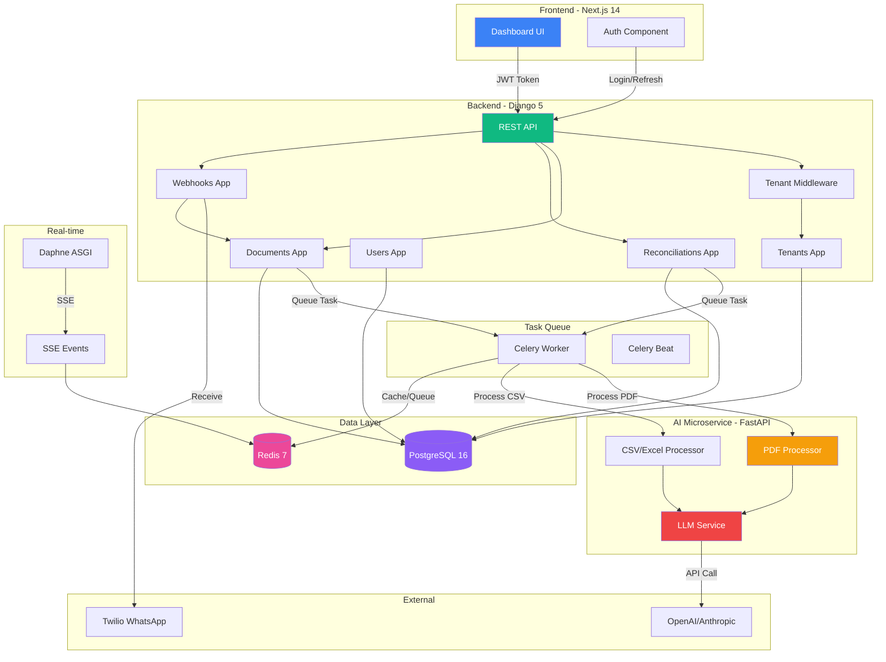
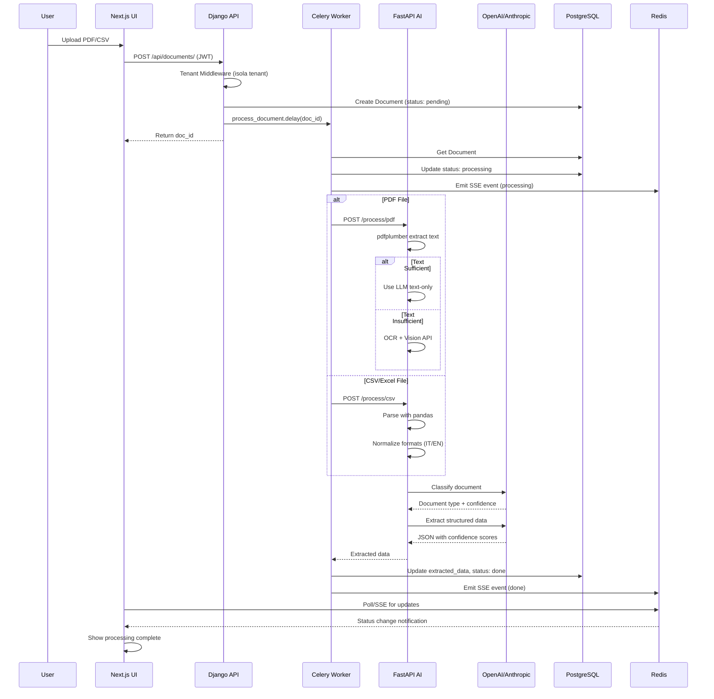
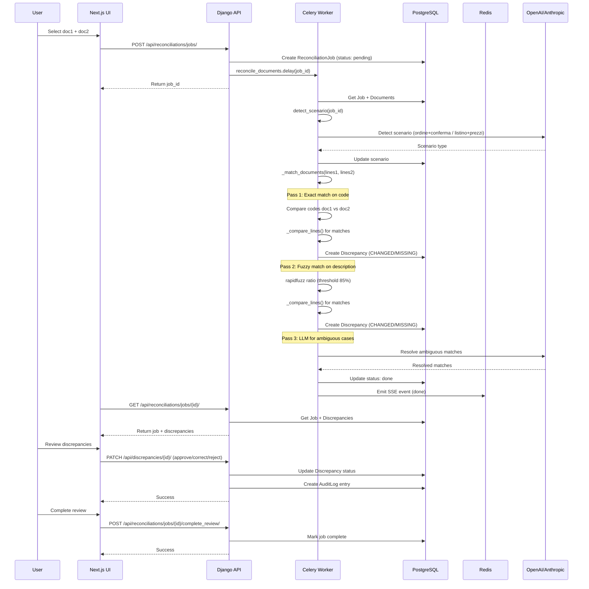
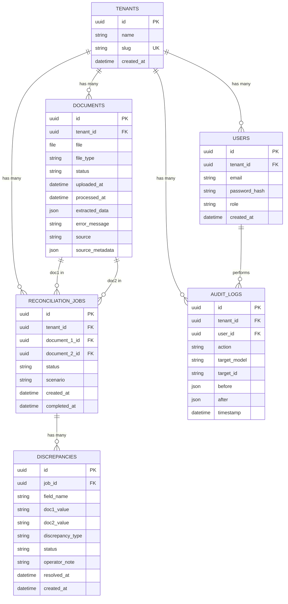
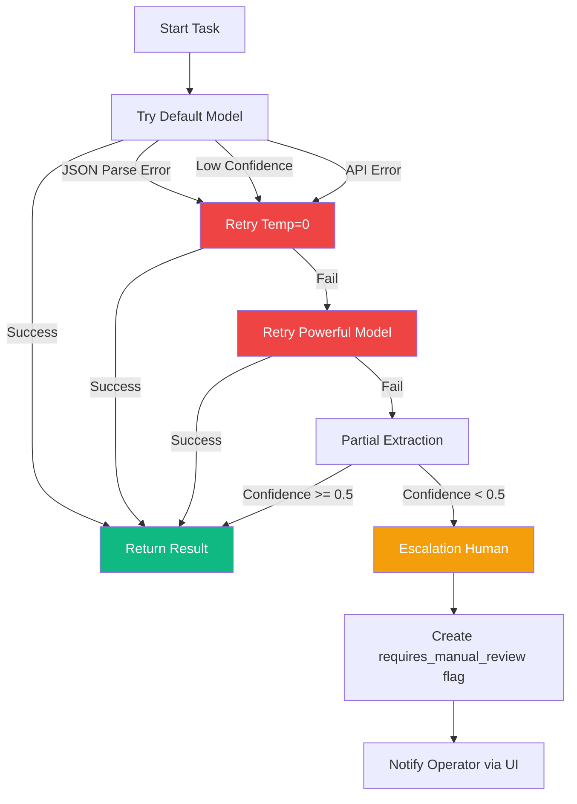
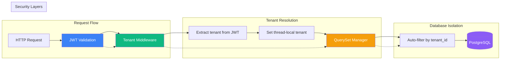
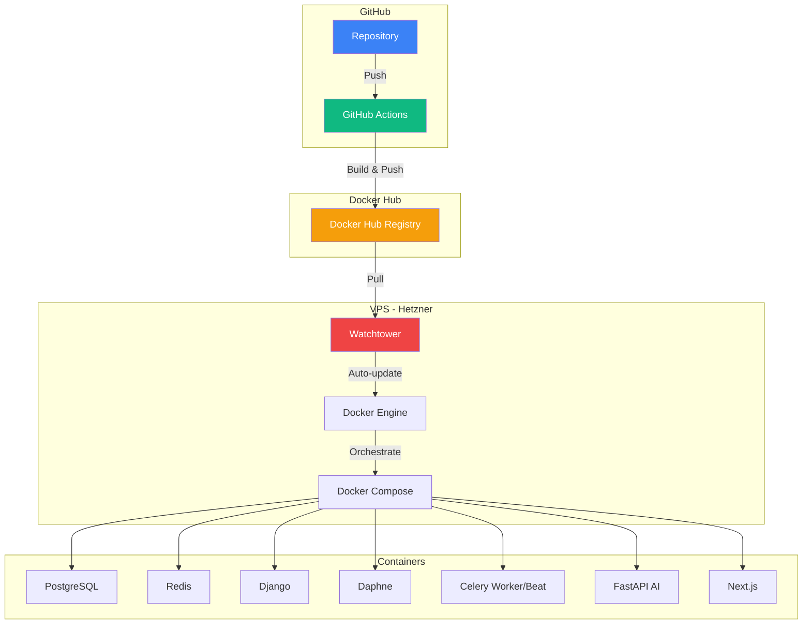

# Architettura WeWill

## Diagramma Architettura Generale

## Flusso Completo Ingestione Documenti

## Flusso Riconciliazione

## Schema Database

## Gestione Errori e Retry

## Multi-Tenant Isolation

## Deploy Architecture

## Tabelle Database

### Tabella: `tenants`
| Colonna | Tipo | Descrizione |
|---------|------|-------------|
| `id` | UUID (PK) | Identificativo univoco |
| `name` | VARCHAR(255) | Nome tenant |
| `slug` | VARCHAR(255) (UK) | Slug URL-friendly |
| `created_at` | TIMESTAMP | Data creazione |

### Tabella: `users`
| Colonna | Tipo | Descrizione |
|---------|------|-------------|
| `id` | UUID (PK) | Identificativo univoco |
| `tenant_id` | UUID (FK) | Tenant appartentenza |
| `email` | VARCHAR(255) (UK) | Email utente |
| `password_hash` | VARCHAR(255) | Hash password |
| `role` | VARCHAR(50) | Ruolo (admin/user) |
| `created_at` | TIMESTAMP | Data creazione |

### Tabella: `documents`
| Colonna | Tipo | Descrizione |
|---------|------|-------------|
| `id` | UUID (PK) | Identificativo univoco |
| `tenant_id` | UUID (FK) | Tenant appartentenza |
| `file` | FILE | File documento |
| `file_type` | VARCHAR(10) | pdf/csv/xlsx/xls |
| `status` | VARCHAR(20) | pending/processing/done/error |
| `uploaded_at` | TIMESTAMP | Data upload |
| `processed_at` | TIMESTAMP | Data processing |
| `extracted_data` | JSON | Dati estratti |
| `error_message` | TEXT | Messaggio errore |
| `source` | VARCHAR(50) | dashboard/whatsapp/mock |
| `source_metadata` | JSON | Metadata sorgente |

### Tabella: `reconciliation_jobs`
| Colonna | Tipo | Descrizione |
|---------|------|-------------|
| `id` | UUID (PK) | Identificativo univoco |
| `tenant_id` | UUID (FK) | Tenant appartentenza |
| `document_1_id` | UUID (FK) | Primo documento |
| `document_2_id` | UUID (FK) | Secondo documento |
| `status` | VARCHAR(20) | pending/processing/done/error |
| `scenario` | VARCHAR(100) | order_confirmation/price_confirmation/unknown |
| `created_at` | TIMESTAMP | Data creazione |
| `completed_at` | TIMESTAMP | Data completamento |

### Tabella: `discrepancies`
| Colonna | Tipo | Descrizione |
|---------|------|-------------|
| `id` | UUID (PK) | Identificativo univoco |
| `job_id` | UUID (FK) | Job parent |
| `field_name` | VARCHAR(255) | Nome campo |
| `doc1_value` | TEXT | Valore documento 1 |
| `doc2_value` | TEXT | Valore documento 2 |
| `discrepancy_type` | VARCHAR(50) | missing/changed/equivalent_different |
| `status` | VARCHAR(20) | pending/approved/corrected/rejected |
| `operator_note` | TEXT | Note operatore |
| `resolved_at` | TIMESTAMP | Data risoluzione |
| `created_at` | TIMESTAMP | Data creazione |

### Tabella: `audit_logs`
| Colonna | Tipo | Descrizione |
|---------|------|-------------|
| `id` | UUID (PK) | Identificativo univoco |
| `tenant_id` | UUID (FK) | Tenant appartentenza |
| `user_id` | UUID (FK) | Utente azione |
| `action` | VARCHAR(100) | Azione eseguita |
| `target_model` | VARCHAR(100) | Modello target |
| `target_id` | VARCHAR(100) | ID target |
| `before` | JSON | Stato prima |
| `after` | JSON | Stato dopo |
| `timestamp` | TIMESTAMP | Data azione |
